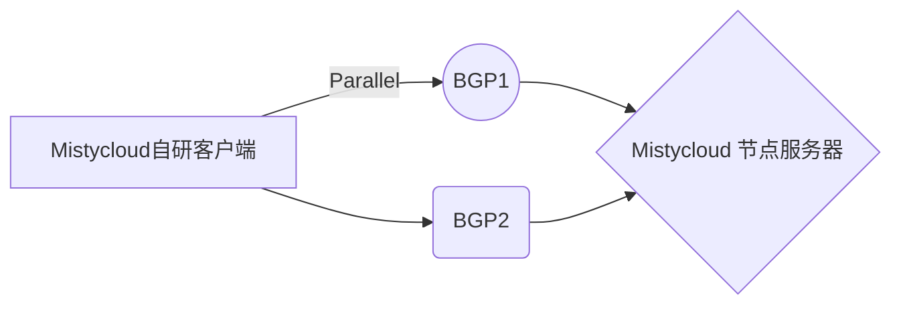

# Mistycloud 机场介绍 官网地址

地址：[https://mistycloud.io](https://mistycloud.io?from=github)

## 简介

Mistycloud  机场最近首屈一指的翻墙高端机场，科学上网首选。已稳定运行多年。提供了强大的隐私保护和安全性。他们的服务器分布在全球许多国家，提供了大量的选项，以满足各种需求。三线 BGP中转+沪日IEPL专线，独享带宽，日本，美国自有机房，晚高峰4K无压力，被广大用户所喜爱 并命名为5G时代的VPN。iOS，android, PC, Mac均有自研客户端，不再需要繁琐配置。

付款方式提供支付宝，微信，信用卡，银联等。

## Mistycloud自研隧道协议Parallels 保证网络不受干扰

## 年付价格低至1.4元/天
性价比极高的套餐，更有流量版为轻度用户可选。高端专线机场性价比首选。

## 稳定服务多年 风雨无阻 为你的科学上网扬帆出海 保驾护航
Mistycloud自成立以来 已稳定运行超过5年。团队来自海外，告别你的失联烦恼
立刻访问 [https://mistycloud.io](https://mistycloud.io?from=github)
